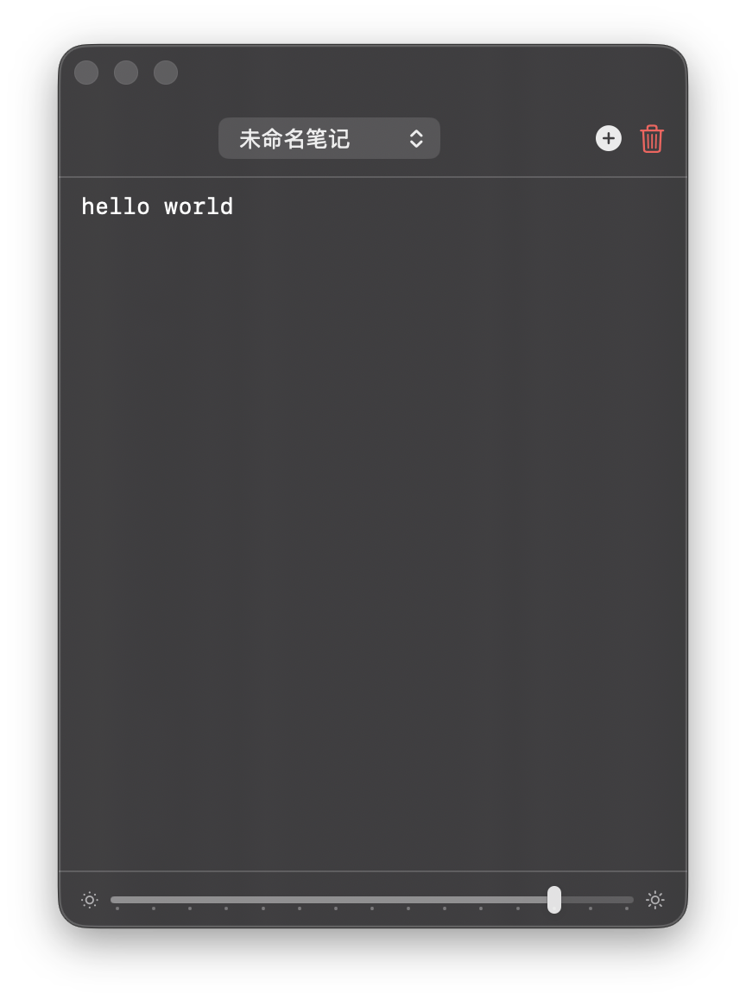
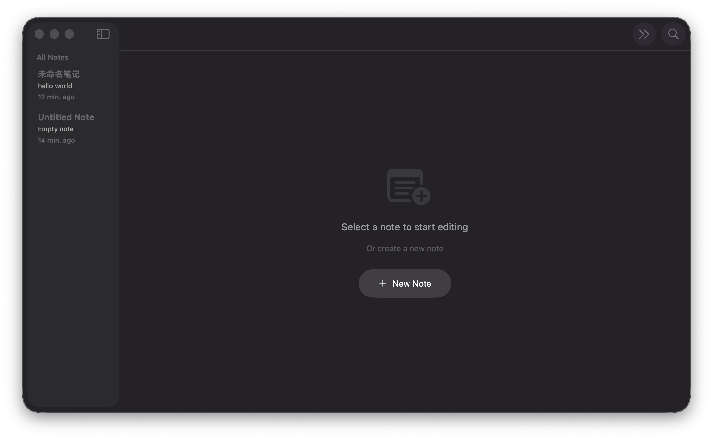

# EzNote

一个面向 macOS 的轻量级原生悬浮记事本。

它的目标很简单：在你写代码、开会、查资料、全屏工作时，随时用一个全局快捷键拉出一块可编辑的便签区域，记完马上收起，不打断当前上下文。

## 特性

- 全局快捷键呼出/隐藏悬浮面板，默认 `⌘⌃N`
- 悬浮在普通窗口和全屏应用之上
- 菜单栏常驻，不占用 Dock 空间进行常驻操作
- 支持多条笔记，快速切换当前编辑内容
- 自动保存，输入后自动持久化到本地
- 主窗口管理全部笔记，支持搜索、重命名、删除、置顶
- 支持自定义全局快捷键
- 支持调节悬浮面板透明度
- 自动记忆悬浮面板的位置和尺寸
- 自动适配系统深色 / 浅色模式

## 适合谁

EzNote 适合这些场景：

- 需要在全屏 IDE、终端、浏览器之间快速记临时信息
- 不想切桌面、不想切应用，只想“记一下就收回去”
- 想要一个比便签更轻、更快、更接近系统原生体验的工具

## 系统要求

- macOS 14.0+ (Sonoma)
- Swift 5.9+

## 运行截图





## 快速开始

### 方式一：本地构建并打开 App

```bash
make bundle
open build/EzNote.app
```

### 方式二：直接运行开发版本

```bash
make debug
```

## 构建命令

```bash
# 构建 release 可执行文件
make build

# 生成 .app 包
make bundle

# 生成后直接打开应用
make run

# 运行 debug 构建
make debug

# 清理构建产物
make clean
```

## 使用说明

1. 启动应用后，菜单栏会出现 EzNote 图标。
2. 按默认快捷键 `⌘⌃N` 呼出悬浮面板，再按一次隐藏。
3. 在悬浮面板里直接编辑当前笔记，内容会自动保存。
4. 点击菜单栏图标可打开主窗口，管理所有笔记。
5. 在主窗口中可搜索、置顶、删除笔记，也可以修改快捷键。

## 权限说明

EzNote 使用全局快捷键唤起悬浮面板，因此首次使用时通常需要授予辅助功能权限：

`系统设置 -> 隐私与安全性 -> 辅助功能`

如果你发现快捷键没有响应，优先检查这里是否已经允许 EzNote。

## 数据存储与隐私

- 所有笔记仅保存在本机，不依赖云服务
- 默认存储路径：`~/Library/Application Support/EzNote/notes.json`
- 悬浮面板位置、尺寸、透明度和快捷键配置会保存在本地 `UserDefaults`

目前项目没有联网同步、账户系统或远程上传逻辑。

## 项目结构

```text
Sources/EzNote/
├── Models/        # 笔记数据模型与本地持久化
├── Services/      # 悬浮面板、全局快捷键、应用内设置
├── Views/         # 主窗口、悬浮面板、通用组件
├── Utils/         # 常量与通知定义
├── AppDelegate.swift
└── EzNoteApp.swift

Resources/
├── Info.plist
├── AppIcon.icns
└── build_icon.sh
```

## 技术栈

- SwiftUI
- AppKit
- `NSPanel` 实现悬浮面板
- Carbon HotKey API 实现全局快捷键
- `Codable + JSON` 做本地持久化

## 当前实现说明

- 默认会创建一条欢迎笔记，方便首次启动时立即使用
- 默认快捷键是 `⌘⌃N`，并支持在应用内改成其他组合
- 全局快捷键至少需要一个修饰键，避免误触
- 应用关闭前会主动保存，编辑过程中也会自动保存

## Roadmap

- 更完整的导入 / 导出能力
- Markdown 或富文本支持
- 可选的数据备份与同步方案
- 更细的快捷键和面板行为配置

## License

MIT
